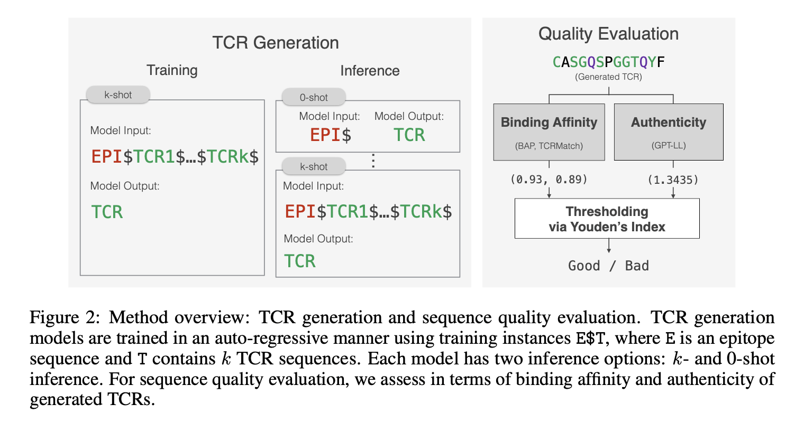

# In-context learning enhances T cell receptors generation for novel epitopes

This repository is the official implementation of [TCRGen](). 

>📋  Abstract: Computational design of T cell receptors (TCRs) that bind to novel epitopes holds the potential to revolutionize targeted immunotherapy. Currently, only a few computational approaches exist and either they fail to generate TCRs for novel epitopes or they perform poorly. In this study, we explore to find strategies of incorporating in-context learning to language models trained with a narrow set of domain-specific texts (e.g. biological sequences) to improve performance of new generative tasks, in TCR generation problem. We extend in-context learning from an inference-only technique to both training and inference processes. By incorporating known binding TCRs as contextual prompts during training, our model, TCRGen-k, learns to understand the intricate relationships between epitopes and their corresponding TCRs more effectively. This alignment of training and inference methodologies significantly improves the generation of TCRs for unseen epitopes. We further establish a comprehensive evaluation framework for assessing the quality of generated TCRs at three distinct levels: amino acid, k-mer, and sequence level, focusing on both binding affinity to ensure effective epitope recognition and sequence authenticity to verify biological plausibility. 




## Requirements

To install requirements:

```setup
pip install torch==2.0.1 transformers==4.20.1
```


## Training

>📋  To train the model(s), and use them for inferences, run the following command:

```
python train.py
python inference_0_shot.py # zero-shot inferences
python inference_k_shot.py # in-context inferences
```


## Evaluation

>📋  To evaluate the quality of generated sequences, run:

```eval
bash eval/run_eval.sh
```

## Pre-trained Models

Pre-trained weights for TCRGen-0 and TCRGen-k can be downloaded from the models folder. 